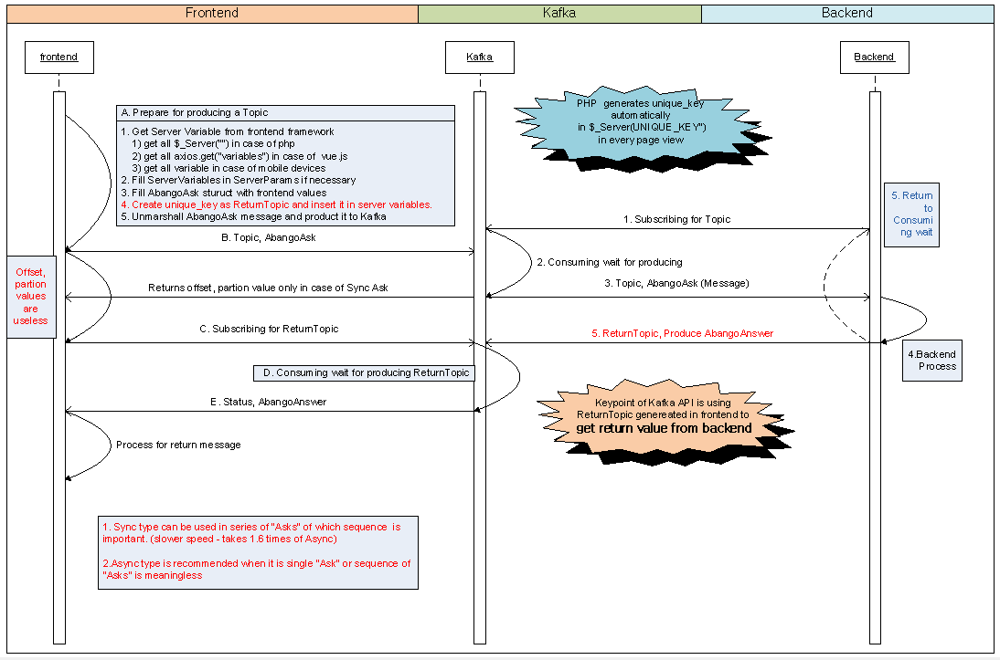

# abango
## Microservices Framework to support Apache Kafka, gRpc and REST API

### Abango
is a golang web framework which supports Kafka, gRpc and RESTful API at the same time in single/multi thread.

## Supported Go versions

- 1.9.7+
- 1.10.3+
- 1.11+

Any of these versions will allow you to import Abango as github.com/dabory/abango which is the recommended way of using abang.

## Feature Overview

- Supports Apache Kafka ( 1 to many - similar like gRpc API )
- supports gRpc API 
- supports REST API powered by Echo framework in go lang

## Development Material

- gRpc from Google
- Echo - the best RESTful API in golang so far
- Kafka-Docker
- Sarama - Golang library for Kafka written by Shopify
- Xorm - Simple and strong ORM written in Golang
- Python Django, Golang Beego - Inspire to give birth to Abango.

## Credits

- Eric Kim (김호익) - Author - kimhi65@gmial.com

## Abango Quick Start

### Step 1: Linux: Ubuntu 16.04.4 LTS \n \l  : recommended Linux version
### Step 2: Install: Go version go1.11 linux/amd64
### Step 3: Install: Go libraries
- `$ go get -u google.golang.org/grpc`

- `$ go get -u github.com/golang/protobuf/protoc-gen-go`

- `$ go get xorm.io/xorm`

- `$ go get github.com/pilu/fresh`

- `$ go get github.com/labstack/echo`

- `$ go get github.com/go-sql-driver/mysql`

- `$ go get github.com/dabory/abango`

- `$ go get github.com/dabory/kafka-docker`

- `$ go get github.com/dabory/svc-abango `

- `$ go get github.com/dabory/end-abango `

- `$ go get github.com/go-xorm/xorm `

### * Here is install shell file for Go librariesis: [goget_all.sh](./goget_all.sh)

#### Step 4: Run kafka service (Not necessary if using gRpc and REST API only)

To run Apache Kafka, use this command in one terminal mode

- `$ cd $GOPATH/src/`

- `$ git clone https://github.com/dabory/kafka-docker`

- `$ cd $GOPATH/src/kafka-docker`

- `$ docker-compose up`

#### Step 5: Run abango service 

To run service, use this command in another terminal mode

- `$ cd $GOPATH/src/github.com/dabory/svc-abango`

- `$ vi conf/config_select.json` ....... ; specify config.json file which has xxx prefix in file name

- `$ vi conf/xxx_config.json`  ....... ; change parameter values linked conf file if necessary

- `$ fresh`   ....... ; run service

#### Step 6: To test end-point request and service running
To run request, use this command in the other terminal mode

- `$ cd $GOPATH/src/github.com/dabory/end-abango`

- `$ vi conf/config_select.json` ....... ; specify config.json file which has xxx prefix in file name

- `$ vi conf/xxx_config.json`  ....... ; change parameter and select service api if necessary

- `$ go run main.go login` ....... ; run a request and it returns same value in file ./json-send/login.json

##### You will get : 
[ReturnStatus: 200  ReturnJsonFile: json-receive/login.json]

[{

    "UserId": "admin",
    "Password": "admin-password"

}]

## Description of Operations in each APIs combined.

### Kafka API Procedure
It is crucial in Kafka messaging service to syncronize producing messages and acquire return messages from backend as RESTful API and gRpc API do.

